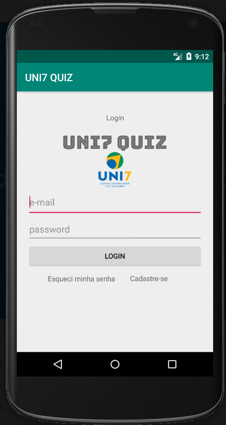
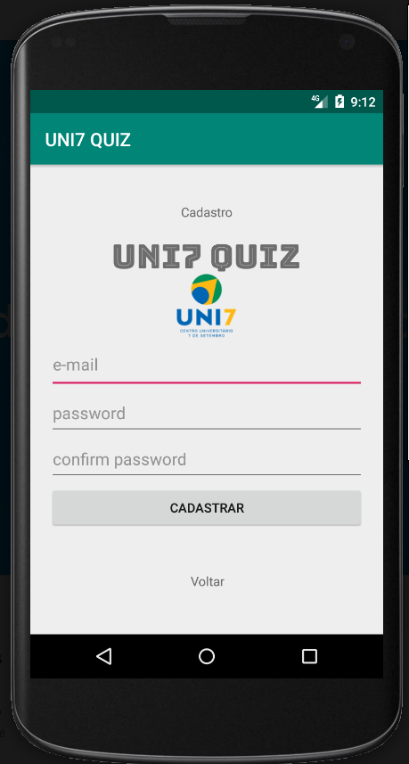
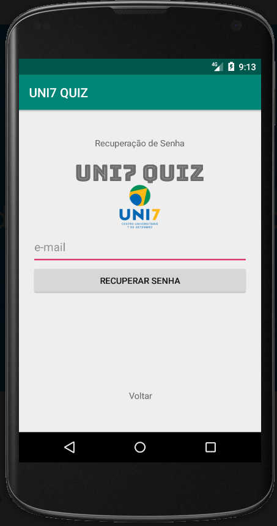

# uni7quiz-android

Android App for post graduate couse.

This project is for academic use only. I do not recommend use in production.

## Installation
Clone this repository and import into **Android Studio**
```bash
git clone git@github.com:nielsenteixeira/uni7quiz-android.git
```
## About Quiz

This is a simple Quiz.
After logging in, the user must answer a list of multiple choice questions and at the end will receive the result.

This app uses [Firebase](https://firebase.google.com/) to register user and auth.

## Samples

#### Login



#### Register



#### Recover Password



#### Question


#### Result

